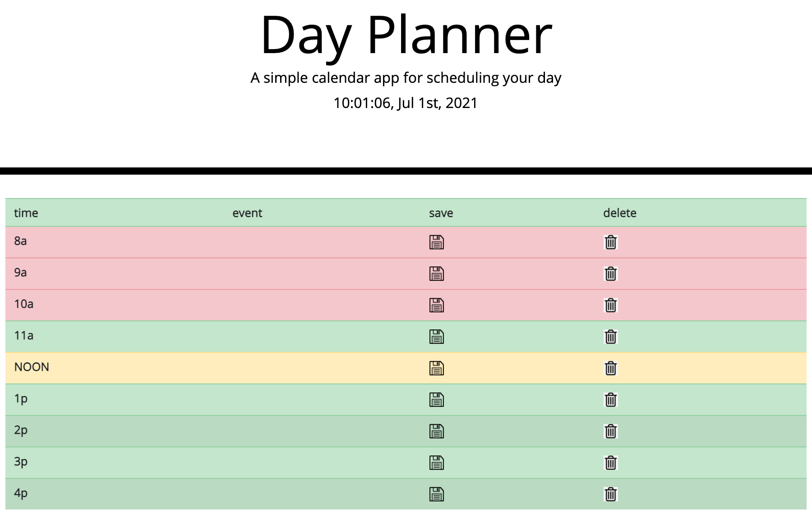

# day-planner
## Plan your day!  

<!-- Instructions for use -->
Link to site: https://jamesboblak.github.io/day-planner/  
This daily planner features a color-changing row feature that keeps track of the time, following you through your day.
  

<!-- Statement of purpose -->
## Purpose
Create, ajdust, and view your daily plan in realtime.  
## Technology utilized to create this page:
<!-- JavaScript Pionts -->
* JavaScript
    * Functions and nested functions
    * Moment clock timer

<!-- JQuery Pionts -->
* JQuery
    * Add class
    * Text query and submission
    * Local storage

<!-- Bootstrap Pionts -->
* Bootstrap
    * Jumbotron header
    * Table creation
    * Custom styling

    <!-- CSS Points -->
* CSS
    * Element and class styling

<!-- Browser compatiblity -->
## Compatiblity and Installation
This HTML website, its CSS style document, and its JavaScript file were created and tested for Chrome, but will load in any browser.  Most modern browsers should play the content of this page as intended, and without issue.  

<!-- Credits -->
## Credits:
Berkeley Coding Boot Camp | UC Berkeley Extension, w3schools.com, developer.mozilla.org  

<!-- License agreement -->
## License
GNU General Public License v3.0  

<!-- Social badges -->
## Badges
